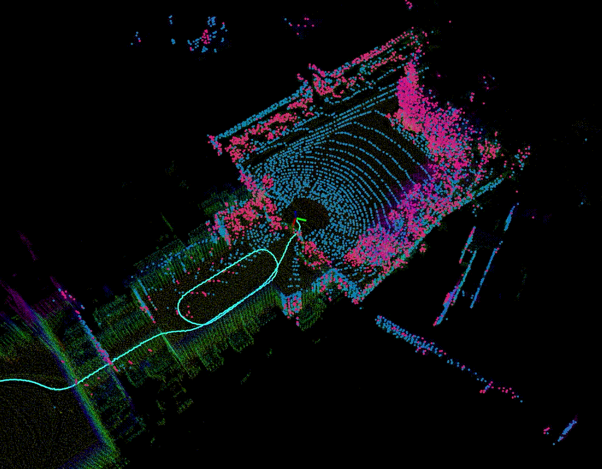

<div align="center">

# GenZ-LIO

**Generalizable LiDAR-Inertial Odometry Beyond Confined–Open Boundaries**

[](cpp/genz_lio)
[](python/README.md)
[](ros/README.md)
[](ros/README.md)
[](LICENSE)

[Demo](https://www.youtube.com/watch?v=EyTJbdC_AA4)
<span>&nbsp;&nbsp;•&nbsp;&nbsp;</span>
[Paper](https://arxiv.org/abs/2603.16273)
<span>&nbsp;&nbsp;•&nbsp;&nbsp;</span>
[Dataset](https://github.com/cocel-postech/NarrowWide)
<span>&nbsp;&nbsp;•&nbsp;&nbsp;</span>
[Install](#installation)
<span>&nbsp;&nbsp;•&nbsp;&nbsp;</span>
[Python](python/README.md)
<span>&nbsp;&nbsp;•&nbsp;&nbsp;</span>
[ROS](ros/README.md)


<br />
<br />

</div>

## About GenZ-LIO

[GenZ-LIO](https://arxiv.org/abs/2603.16273) estimates LiDAR-inertial odometry
across confined spaces, open environments, and transitions between them.
It was evaluated on 42 sequences
from nine public datasets and our [NarrowWide dataset](https://github.com/cocel-postech/NarrowWide) and supports **Python, ROS 1, and ROS 2**.

<details>
<summary>Algorithm overview</summary>

- **Scale-aware adaptive voxelization** adjusts scan downsampling to the environment.
- **Hybrid-metric state update** combines point-to-plane and point-to-point constraints.
- **Voxel-pruned correspondence search** reduces the cost of point-to-point matching.

</details>

## Installation
```bash
pip install genz-lio
```
Next, follow the instructions on how to run the system by typing:
```bash
genz_lio_pipeline --help
```

See [python/README.md](python/README.md) for input formats, visualization, and saving trajectories.

## ROS support

Build instructions, dependencies, and dataset playback are in
[ros/README.md](ros/README.md#installation).

<details>
<summary>ROS 1 Noetic</summary>

After building and sourcing the catkin workspace:

```bash
roslaunch genz_lio odometry.launch config:=default/velodyne.yaml
```

</details>

<details>
<summary>ROS 2 Humble / Jazzy</summary>

After building and sourcing the colcon workspace:

```bash
ros2 launch genz_lio odometry.launch.py config:=default/velodyne.yaml
```

</details>

Both launch RViz by default. Select a calibrated sensor or experiment YAML.
See [benchmark configurations](ros/README.md#benchmark-configurations) and the
[parameter guide](ros/config/parameter_tuning_guide.md).

## :pencil: Citation

If you use GenZ-LIO, please cite our [paper](https://arxiv.org/abs/2603.16273).

```bibtex
@article{lee2026genzlio,
  title={{GenZ-LIO: Generalizable LiDAR-Inertial Odometry Beyond Confined--Open Boundaries}},
  author={Lee, Daehan and Lim, Hyungtae and Kim, Seongjun and Rho, Soonbin and Lee, Changhyeon and Park, Sanghyun and Hong, Junwoo and Choi, Eunseon and Jo, Hyunyoung and Han, Soohee},
  journal={arXiv preprint arXiv:2603.16273},
  year={2026}
}
```

For LiDAR-only odometry, see [GenZ-ICP](https://github.com/cocel-postech/genz-icp)
([arXiv](https://arxiv.org/abs/2411.06766), [IEEE *Xplore*](https://ieeexplore.ieee.org/document/10753079)).

```bibtex
@article{lee2024genzicp,
  author={Lee, Daehan and Lim, Hyungtae and Han, Soohee},
  title={{GenZ-ICP: Generalizable and Degeneracy-Robust LiDAR Odometry Using an Adaptive Weighting}},
  journal={IEEE Robotics and Automation Letters (RA-L)},
  year={2025},
  volume={10},
  number={1},
  pages={152--159},
  doi={10.1109/LRA.2024.3498779}
}
```

## :sparkles: Contributors

Bug reports, documentation improvements, and pull requests are always welcome.  
Contributions are greatly appreciated, and we would be happy to see your profile appear below!

<a href="https://github.com/cocel-postech/genz-lio/graphs/contributors">
  
</a>

## :pray: Acknowledgments and license

Many thanks to the [HKU-MARS Lab](https://github.com/hku-mars) and the KISS-ICP team at [PRBonn](https://github.com/PRBonn) for their open-source contributions to the robotics community.

GenZ-LIO builds on [PV-LIO](https://github.com/HViktorTsoi/PV-LIO),
[VoxelMap](https://github.com/hku-mars/VoxelMap),
[FAST-LIO](https://github.com/hku-mars/FAST_LIO), and
[IKFoM](https://github.com/hku-mars/IKFoM). We also thank the
[KISS-ICP](https://github.com/PRBonn/kiss-icp) project.

GenZ-LIO is distributed under [GPL-2.0](https://github.com/cocel-postech/genz-lio/blob/master/LICENSE); dependency modifications are listed in [PATCHES.md](https://github.com/cocel-postech/genz-lio/blob/master/cpp/genz_lio/3rdparty/PATCHES.md).

## :mailbox: Contact

For questions and bug reports, open an
[issue](https://github.com/cocel-postech/genz-lio/issues) or contact
[Daehan Lee](https://github.com/Daehan2Lee) ( :envelope: daehanlee `at` postech `dot` ac `dot` kr)
